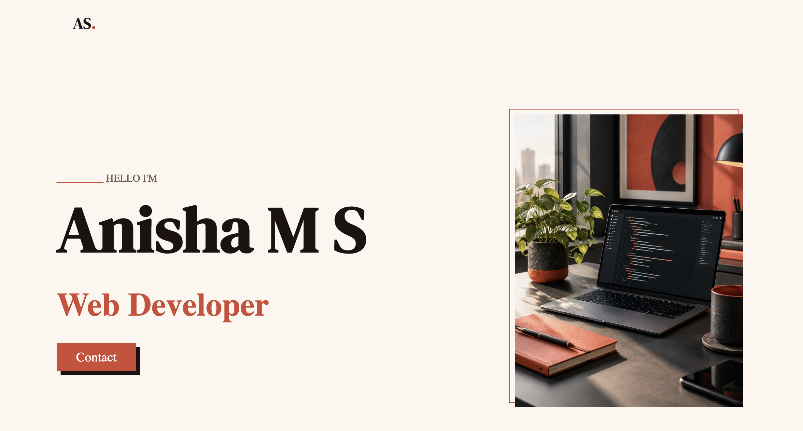

##Personal Portfolio

A simple and responsive personal portfolio website built to showcase my profile, skills, and contact information.

## 🌐 About the Project

This portfolio is a beginner-friendly web project created using **HTML and CSS**.
It includes a clean home section to introduce myself and a contact form for visitors to get in touch.

🚀 Live Demo

View Live Website (#https://anishasubramanian.github.io/portfolio_simple_design/)

## ✨ Features
* Home 
* Contact form
* Simple and clean UI

## 🛠️ Technologies Used
* HTML5
* CSS3
* Google Fonts

## 📂 Project Structure
```text
portfolio/
│
├── index.html
├── contact.html
├── style.css
└── README.md
```
## 📸 Preview

## 📸 Preview



## 🚀 How to Run
1. Clone this repository:

```bash
git clone <your-repository-url>
```

2. Open the project folder.
3. Open `index.html` in your browser.


## 🔮 Future Improvements

* Add Projects section
* Add Skills section
* Add About Me page
* Add responsive navigation
* Add JavaScript interactions
* Improve contact form functionality

## 👩‍💻 Author
**Anisha**
A web developer learning and building projects with HTML, CSS, JavaScript, and modern web technologies.
